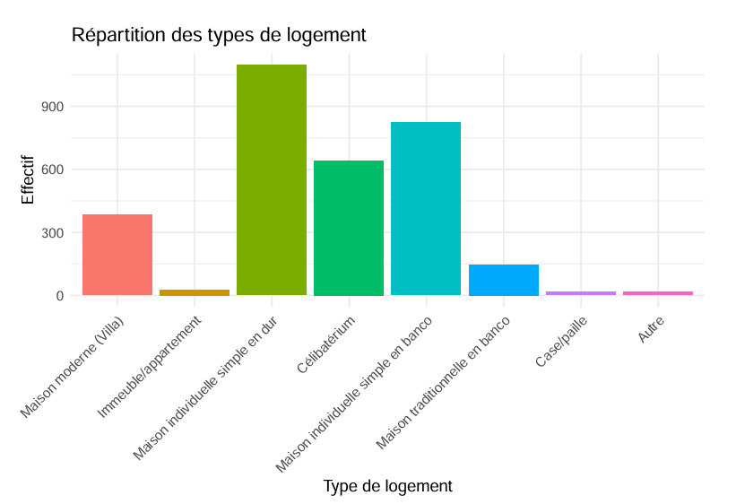
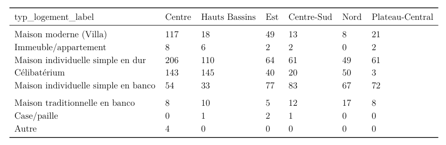
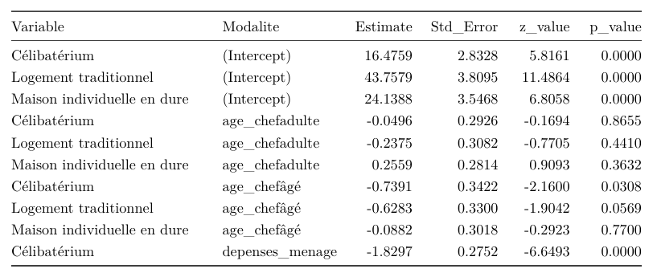

<p align="center">


</p>


<p align="center">
  <a href="#">
    
  </a>
  &nbsp;
  <a href="https://LIEN_VERS_TON_PORTFOLIO">
    
  </a>
</p>

# Executive Summary

In a context of rapid urbanization and sustained demographic growth in Burkina Faso, understanding the factors influencing household housing choices has become a major challenge for both real estate stakeholders and public decision-makers.

This project investigates the determinants of housing type occupied by urban households using data from the Harmonized Household Living Conditions Survey (EHCVM 2018). The study relies on an econometric framework based on Multinomial Logistic Regression to explain differences observed across several housing categories.

The analysis combines socioeconomic, demographic, geographic, and housing-condition variables. Advanced data processing techniques were also employed, including Principal Component Analysis (PCA), Multiple Correspondence Analysis (MCA), Multiple Imputation, Cross-Validation, and comprehensive statistical diagnostics.

### 🚀 Key Results

✔ More than 3,000 urban households analyzed

✔ Construction of synthetic indicators using PCA and MCA

✔ Multinomial Logistic Regression model estimated on 4 housing categories

✔ McFadden Pseudo R²: **0.393**

✔ Average Cross-Validation Accuracy: **67.5%**

✔ Socioeconomic score, housing quality, and region identified as the main determinants

**Skills Applied:** Econometrics, Multivariate Statistical Analysis, Multinomial Modeling, PCA, MCA, Multiple Imputation, Cross-Validation, and Decision Support Analytics.


# 📌 Background

Burkina Faso has experienced rapid urban growth over recent decades, accompanied by substantial transformations in housing conditions and residential patterns.

Urban households occupy highly diverse housing structures, ranging from modern residential units to traditional mud-brick dwellings. These differences reflect not only household economic conditions but also demographic characteristics, geographic context, and access to infrastructure.

Within this context, the fictional company **ImmoFaso S.A.** seeks to better understand the mechanisms driving residential choices in order to tailor its housing offer to the actual needs of urban households.

> 💡 Research Question: What are the main socioeconomic and demographic factors determining the housing type occupied by urban households in Burkina Faso?


# 🎯 Objectives

- Identify the determinants of housing type among urban households
- Construct synthetic indicators of comfort and socioeconomic status
- Estimate a multinomial logit model capable of predicting housing type
- Assess model robustness through several statistical diagnostics
- Formulate strategic recommendations for the urban housing sector


# 🗂️ Data

<table>
<tr>

<td width="30%" valign="top">
<h3 align="center">Source</h3>

| Characteristic | Description |
|----------------|-------------|
| Source | EHCVM 2018 |
| Country | Burkina Faso |
| Target Population | Urban Households |
| Data Type | Household Survey |
| Target Variable | Housing Type |
| Final Categories | 4 |
| Domain | Housing and Living Conditions |
</td>

<td width="75%" valign="top">

<h3 align="center">Variables retenues</h3>

| Variable | Type | Role |
|-----------|--------|--------|
| `housing_type` | Categorical | Target Variable |
| `occupancy_status` | Categorical | Residential Status |
| `head_age` | Categorical | Demographic Factor |
| `household_size` | Numerical | Household Composition |
| `household_expenditure` | Numerical | Economic Level |
| `socioeconomic_score` | MCA Index | Social Position |
| `comfort_index` | PCA Index | Housing Comfort |
| `housing_quality_score` | Composite Index | Housing Quality |
| `region` | Categorical | Geographic Factor |

</td>

</tr>

</table>


# 🔬 Methodology

EHCVM 2018 Dataset
        │
        ▼
Selection of Urban Households
        │
        ▼
Data Processing
• Missing Value Detection
• Multiple Imputation (MICE)
• Outlier Detection
        │
        ▼
Indicator Construction
• PCA → Comfort Index
• MCA → Socioeconomic Score
• Housing Quality Score
        │
        ▼
Exploratory Analysis
• Descriptive Statistics
• Correlations
• Cramer's V
        │
        ▼
Multinomial Logistic Regression
        │
        ▼
Model Validation
• Likelihood Ratio Test
• Pseudo R²
• Cross Validation
• VIF/GVIF
• Residual Analysis
        │
        ▼
Policy and Business Recommendations


# 🛠️ Technical Stack

<p align="center">


</p>


# 📊 Results

<table>
<tr>
<td valign="top" width="50%">

<h3>Performance globale</h3>

| Indicator | Value |
|------------|--------|
| AIC | 4658.2 |
| LRT | 2913.97 |
| p-value | < 0.0001 |
| McFadden Pseudo R² | 0.393 |
| Average CV Accuracy | 67.5% |

</td>

<td valign="top" width="50%">

<h3>Validation croisée</h3>

| Fold | Accuracy |
|--------|----------|
| Fold 1 | 65.5% |
| Fold 2 | 66.3% |
| Fold 3 | 69.6% |
| Fold 4 | 68.8% |
| Average | 67.5% |

</td>

<td valign="top" width="50%">

<h3>Diagnostic du modèle</h3>

| Diagnostic | Result |
|------------|--------|
| Multicollinearity | Absent |
| Maximum Adjusted GVIF | 1.36 |
| Residuals | Acceptable |
| Overall Fit | Good |
| Statistical Validity | Confirmed |

</td>
</tr>
</table>

## Visualizations

### Distribution of Housing Types



### Regional Analysis



### Wald Test



### Key Determinants of Housing Type

```text
Socioeconomic Score      ████████████████████
Housing Quality          ██████████████████
Occupancy Status         ████████████████
Region of Residence      ██████████████
Comfort Index            ████████████
Household Expenditure    ██████████
Household Size           ████████
Age of Household Head    ██████
```


# 💡 Economic Interpretation

### 1. Socioeconomic Effect

Households with higher socioeconomic status are more likely to occupy modern and better-equipped housing units.

### 2. Housing Quality Effect

The quality of walls, floors, and roofing materials significantly influences the observed housing category.

### 3. Territorial Effect

Substantial differences are observed across urban regions, reflecting disparities in economic development and urbanization.

### 4. Occupancy Status Effect

Residential behavior differs significantly between homeowners and tenants, directly influencing the type of housing occupied.


# 🌍 Potential Impact

The results can support:

- Real Estate Developers
- Urban Planners
- Ministry of Housing
- Local Governments
- Consulting Firms
- Urban Economics Researchers
- Development Institutions
- International Organizations


# ⚠️ Limitations

- Analysis restricted to 2018 data
- Some socioeconomic variables remain unobserved
- Housing categories were aggregated to improve model robustness
- Cross-sectional nature of the dataset
- Lack of detailed information on individual residential preferences


# 🧠 Skills Developed

| Domain | Skills |
|---------|---------|
| Econometrics | Multinomial Logistic Regression |
| Statistics | PCA, MCA, Descriptive Analysis |
| Data Cleaning | Multiple Imputation, Outlier Treatment |
| Validation | Cross Validation, Statistical Diagnostics |
| Data Analysis | Correlations, Cramer's V, Interpretation |
| R Programming | Data Manipulation, Visualization, Modeling |
| Decision Support | Translating Results into Recommendations |


# 👥 Team & Supervision

## Developed by

<table align="center">
  <tr>
    <td align="center">
      <b>NIAMPA Abdoul Fataho</b><br/>
      <sub>Licence Analyse Statistique — ISSP</sub>
      <a href="https://github.com/fatah">
        
      </a>
    </td>
    <td align="center">
      <b>SAWADOGO Pengdwendé Orianne-Aurele</b><br/>
      <sub>Licence Analyse Statistique — ISSP</sub>
      <a href="https://github.com/#">
        
      </a>
    </td>
    <td align="center">
      <b>YAMEOGO Saïdou</b><br/>
      <sub>Licence Analyse Statistique — ISSP</sub><br/>
      <a href="https://github.com/yamsaid">
        
      </a>
    </td>
  </tr>
</table>

## Academic Supervision

<table align="center">
  <tr>
    <td align="center">
      <b>Dr. Boyam Fabrice YAMEOGO</b><br/>
      <sub>Lecturer — Econometrics of Qualitative Variables</sub><br/>
      <sub>Institut Supérieur des Sciences de la Population (ISSP)</sub><br/>
      <sub>Université Joseph Ki-Zerbo, Ouagadougou 🇧🇫</sub>
    </td>
  </tr>
</table>


# 📁 Project structure

```text
📦 determinants-logement-burkina/
├── README.md
├── data/
│   └── ehcvm_2018.feather
├── scripts/
│   ├── nettoyage.R
│   ├── construction_indices.R
│   ├── modelisation_multinomiale.R
│   └── validation_modele.R
├── figures/
│   ├── repartition_logements.png
│   ├── analyse_regionale.png
│   ├── cramer_matrix.png
│   └── residus_multinomiaux.png
├── rapport/
│   └── rapport_final.pdf
└── outputs/
    └── resultats_modeles.xlsx
```


# 📄 Lire le rapport

<p align="center">
        
</p>

[**Lire le rapport**](rapport.pdf)


# 📚 Références bibliographiques

* Agresti, A. (2018). *Statistical Methods for the Social Sciences*.
* Hosmer, D., Lemeshow, S. & Sturdivant, R. (2013). *Applied Logistic Regression*.
* Hair, J. et al. (2019). *Multivariate Data Analysis*.
* Greene, W. (2018). *Econometric Analysis*.
* INSD (2021). *Enquête Harmonisée sur les Conditions de Vie des Ménages (EHCVM 2018)*.
* Institut Supérieur des Sciences de la Population (ISSP).


<sub>Project completed as part of the Econometrics of Qualitative Variables course — ISSP · Joseph Ki-Zerbo University · Burkina Faso 🇧🇫</sub>


